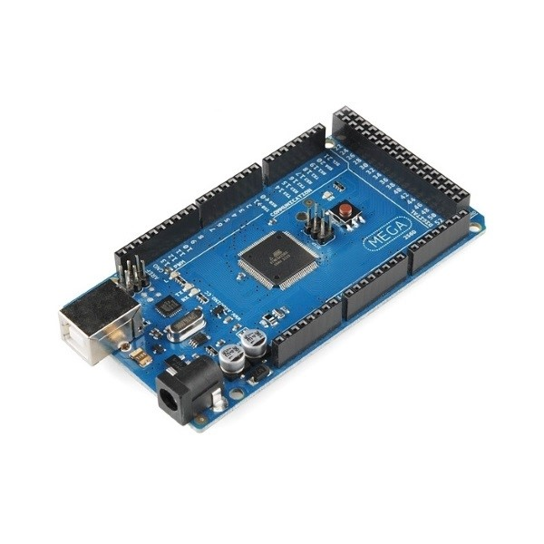

Hardware Requirements
=====================

The following **hardware requirements** are necessary to use Benchmark Arduino Mega 2560:

   - Arduino Mega 2560;

Arduino Mega 2560
-----------------

The Arduino Mega 2560 is a microcontroller board based on the ATmega2560. It has 54 digital input/output pins (of which 15 can be used 
as PWM outputs), 16 analog inputs, 4 UARTs (hardware serial ports), a 16 MHz crystal oscillator, a USB connection, a power jack, 
an ICSP header, and a reset button. It contains everything needed to support the microcontroller; simply connect it to a computer 
with a USB cable or power it with a AC-to-DC adapter or battery to get started. The Mega 2560 board is compatible with most shields 
designed for the Uno and the former boards Duemilanove or Diecimila.
Key features are listed below, hardware details can be found into [datasheet](mega2560.pdf):

    - Supply voltage (recommended): 7V ~ 12V;
    - Supply voltage (limits): 6V ~ 20V;
    - Operating voltage: 5V;
    - Microcontroller: ATmega2560;
    - Digital I/O pins: 54 (of which 15 provide PWM output);
    - Analog input pins: 16;
    - DC Current per I/O Pin: 20 mA;
    - DC Current for 3.3V Pin: 50 mA;
    - Flash memory: 256Kb (8Kb used by bootloader);
    - SRAM: 8Kb;
    - EEPROM: 4Kb;
    - CPU clock: 16MHz;

.. image:: _static/mega2560_pinout.png
   :align: center
   :alt: Arduino Mega 2560 Pinout

.. toctree::
   :name: hw_req
   :maxdepth: 2
   :caption: Hardware Requirements